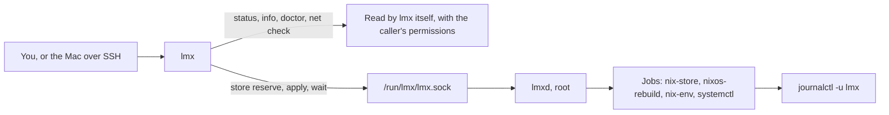

# The daemon under systemd

`lmx` does most of its work by itself: it reads the system with your own
permissions and prints the answer. A few jobs must outlive the shell that asked
for them, such as an update build or a store cleanup. Those belong to `lmxd`,
one root daemon per VM.

## Who does what



| Kind of command | Runs in | Without `lmxd` |
| -- | -- | -- |
| Facts: `status`, `info`, `doctor`, `net check`, `version` | `lmx`, as you | Work; `status` marks the `Owner` line unknown |
| Your terminal: `pbcopy`, `pbpaste`, sessions, the welcome | `lmx`, as you | Work |
| Owner jobs: `store reserve`, `apply`, `apply cancel`, `status --wait` | `lmxd`, as root | Fail with exit status 3; `lmx` never runs them itself |

## Who may ask what

Every user in the guest may connect to the socket. `lmxd` reads the caller's
identity from the connection itself and decides from it:

| Request | Allowed for |
| -- | -- |
| What `lmxd` is doing, its conditions and its jobs | Everyone |
| Making room in the store, building, cancelling a build | root |

Nothing listens on the network. The Mac reaches `lmxd` only through SSH and
`sudo lmx`.

## How systemd runs it

The platform defines two units in every generation.

| Setting | Why |
| -- | -- |
| `lmx.socket` listens on `/run/lmx/lmx.sock` | The socket outlives the daemon: calls wait while `lmxd` restarts |
| `lmx.service` starts at boot, not only on the first call | The store guard and the generation check must run even when nobody asks |
| `Type=notify` | systemd treats `lmxd` as started once it is ready to serve |
| `WatchdogSec=30s` and `Restart=on-failure` | A frozen or crashed daemon is stopped and started again |
| `KillMode=control-group` | Jobs such as `nixos-rebuild` stop together with the daemon |
| `LimitCORE=0` | A watchdog stop does not dump the memory of every job |
| The service does not restart on a switch | A configuration switch never stops `lmxd` in the middle of a job; the new `lmxd` arrives with the next boot |

> [!NOTE]
>
> These units come from the platform of the client, in
> [`lmx.nix`](https://github.com/limanix/client/blob/main/internal/nixos/resources/base/lmx.nix).
> `lmx` itself ships only the two binaries.

## A second daemon during an update

For an update, the Mac stops both units and starts the `lmxd` of the *new*
generation as a temporary unit, `lmx-transient`. That daemon only builds: it
neither cleans the store nor checks generations. After the restart, the regular
`lmxd` of the new generation takes over.

Only one daemon serves the socket at a time. A second one refuses a socket that
another daemon still serves, and two builds never run at once.

## Its configuration

NixOS writes `/etc/lmx/config.json` as part of every generation: the VM name,
your account, the disk thresholds, the health checks, the open ports, the
colors, and the absolute paths of the tools `lmxd` runs. Beside it,
`/etc/lmx/help.json` holds the help cards of the modules in the generation, for
`lmx help TOPIC`. Nothing on the Mac changes it at runtime. Each generation
carries its own configuration, and the two always match.

<details>
<summary>Read the daemon's own log</summary>

```console
$ sudo journalctl -u lmx
$ sudo journalctl -u lmx LMX_KIND=SystemApply
```

Every line of a job carries `LMX_TASK` and `LMX_KIND`. `lmx logs` uses them to
find a run; you can filter by them too.

</details>
