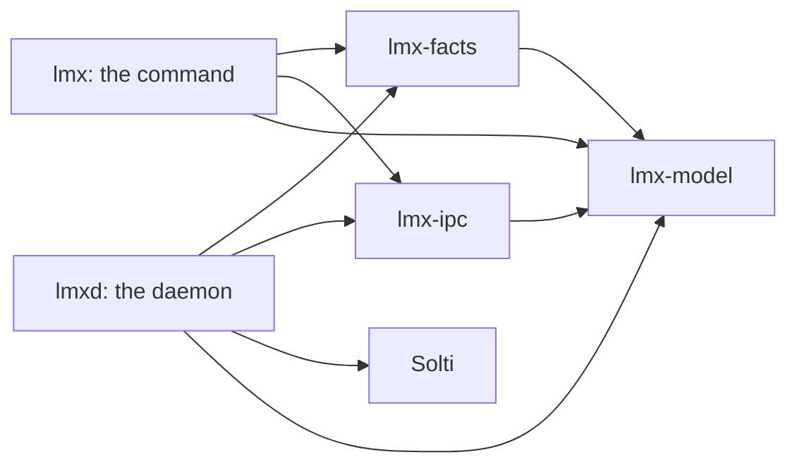

# Development

This page is for people who change `lmx` itself. You need
[Task](https://taskfile.dev/docs/installation) 3.53.1 or newer, Git and Docker.

## Run the checks

Every task runs in a container, the same one CI uses.

| Task | Does |
| -- | -- |
| `task ci/rust/fmt` | Checks Rust formatting |
| `task ci/rust/clippy` | Lints every target and denies warnings |
| `task ci/rust/test` | Runs unit and integration tests |
| `task ci/rust/docs/check` | Builds the API documentation and denies rustdoc warnings |
| `task ci/rust/audit` | Scans dependencies for advisories |
| `task ci/markdown/fmt` | Checks Markdown formatting |
| `task docs/prepare` | Prepares these guides for the LimaNix site in `build/docs` |
| `task release/build [ARCH=…]` | Builds `dist/lmx-<version>-<ARCH>-linux.tar.gz` and its checksum, for `aarch64` or `x86_64`; the current machine's by default |

A pull request runs all of them. `task rust/fix` and `task markdown/fix` apply
the formatting that the checks expect.

## How the code is split

| Crate | Owns | Start here |
| -- | -- | -- |
| `lmx-model` | Every value that crosses a process boundary: the configuration from NixOS, the JSON envelope, error codes, status and apply | [`lib.rs`](../crates/lmx-model/src/lib.rs) |
| `lmx-facts` | Reading the running system: disk, generations, mounts, network, sockets, journal, failed units | [`lib.rs`](../crates/lmx-facts/src/lib.rs) |
| `lmx-ipc` | The `lmx.v1.Owner` protocol and its Unix-socket client | [`owner.proto`](../crates/lmx-ipc/proto/lmx/v1/owner.proto) |
| `lmx` | The command: parsing, other names such as `pbcopy`, text and JSON output | [`main.rs`](../crates/lmx/src/main.rs) |
| `lmxd` | The daemon: the socket, systemd, the store guard, apply and the generation observer | [`main.rs`](../crates/lmxd/src/main.rs) |

## Rules that keep it working

- A value that crosses a process boundary lives in `lmx-model`. A field anywhere
  else is not part of any contract.
- `lmx-facts` only reads. It never changes the system and never needs the
  daemon.
- A reader that runs a program keeps the process I/O apart from a pure parser;
  tests feed the parser fixed output.
- Owner jobs run only in `lmxd`. `lmx` never runs them itself when the daemon is
  down.
- Commands that need your terminal, the clipboard and sessions, stay in `lmx`.
- `lmx` and `lmx-ipc` do not depend on Solti; only `lmxd` does.
- `lmxd` runs programs only as Solti tasks, with absolute paths from the
  configuration.
- Configuration comes from NixOS only, never from the Mac at runtime.
- `lmx logs` depends on the journal fields `LMX_TASK`, `LMX_KIND` and
  `LMX_GENERATION`.
- `pbcopy`, `pbpaste` and `limanix-session` keep the syntax of the shell
  commands they replaced.
- Every crate forbids unsafe Rust.

## Add a fact to `lmx status`

1. Add the value to `Status` in `lmx-model`, with a doc comment, and update the
   examples in [`contract/v1/`](../contract/v1).
1. Add a reader to `lmx-facts`: an I/O function and a pure parser with fixture
   tests.
1. Collect it in `lmx/src/status.rs` with `record`, which turns a failure into a
   problem instead of an error.
1. Render it in the text output and extend `crates/lmx/tests/cli.rs`.

A new optional field keeps the contract version. Renaming or removing a field
needs a new one: see
[Change the host contract](contract.md#change-the-host-contract).

## Release

1. Set the version in `Cargo.toml` and merge it to `main`.
1. Push the tag `v<version>` on `main`.
1. The release workflow checks the tag, builds both archives, prepares these
   guides and publishes them together.
1. The LimaNix client pins the release in its `lmx.json`, and the next client
   release brings it to every VM.
