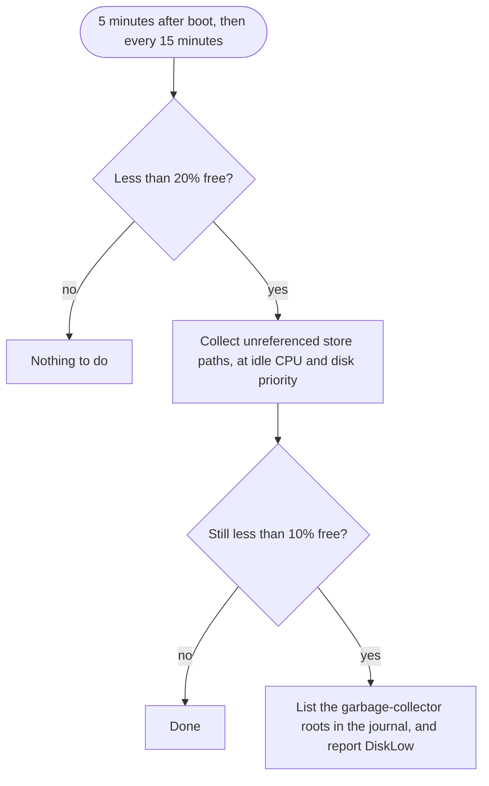

# Disk and the Nix store

Nix keeps every package it ever built or downloaded until something removes it.
A VM that you update for months collects old toolchains, old system generations
and their dependencies. `lmx` cleans that up for you, carefully.

## Two numbers to remember

| Free on the store disk | What happens |
| -- | -- |
| Less than **20%** | `lmxd` removes store paths that nothing uses any more. |
| Less than **10%** | It also lists what still holds space, and `lmx status` warns with `disk-low`. |

"Free" means free bytes *and* free inodes. The guest disk is ext4, which fixes
its number of inodes when the disk is made; a store full of small files can run
out of inodes with gigabytes still free.

## How the guard decides



The collection runs at the lowest CPU and disk priority: your own work always
goes first. `lmxd` also collects once after every successful update, when
finalize has removed the older generations.

## What `lmx` never deletes

Store paths that something still points to stay: these pointers are called
*garbage-collector roots*. Your `nix-direnv` shells and the `result` links from
`nix build` are roots too. `lmx` reports them in the journal and leaves them
alone, because removing them would break the environments that rely on them.

```console
$ sudo lmx logs roots
```

shows the last report. Delete the roots you no longer need yourself, such as old
`result` links, and the next collection frees their space.

## Make room now

```console
$ sudo lmx store reserve
```

collects right away when less than 20% is free, waits for the collection to
finish, and prints the usage before and after. The Mac runs the same command
before every update. A disk that stays low is a warning there, not an error: a
smaller module selection may still fit.

<details>
<summary>The disk is still full. What now?</summary>

1. Run `sudo lmx logs roots` and remove the roots you do not need.
1. Run `sudo lmx store reserve` again.
1. If it is still not enough, give the VM a bigger disk: raise `resources.disk`
   in `limanix.toml` and run `limanix update`. A bigger disk brings more inodes
   too.

</details>

> [!NOTE] Builds have their own safety net. Nix frees space by itself when free
> bytes drop too low in the middle of a build; `lmxd` covers inodes and the time
> between builds.
