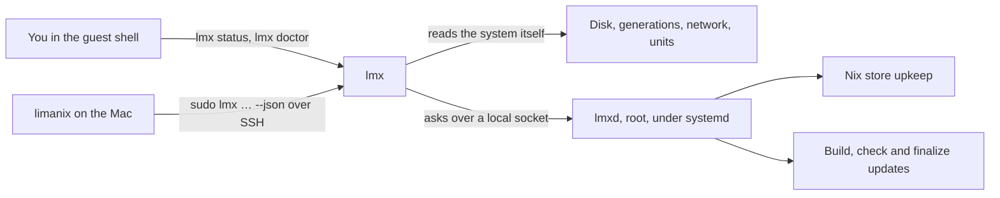

# lmx

`lmx` looks after your VM from the inside. It answers your questions about the
guest, keeps the Nix store from filling the disk, and carries out updates that
the Mac starts.

You meet it as a command in the guest shell. Behind it runs a small daemon,
`lmxd`, that does the work that must not depend on your terminal.



## I want to…

| I want to… | Run in the guest |
| -- | -- |
| See what this VM is and which commands exist | `lmx help` |
| Check disk space, generations and failed services | `lmx status` |
| Find out what is wrong and what to do | `lmx doctor` |
| Learn why the Mac cannot reach my service on a port | `lmx net check 8080` |
| Copy a file to the Mac clipboard | `pbcopy < notes.txt` |
| Read the build output of the last update | `sudo lmx logs apply --previous` |
| Make room in the Nix store now | `sudo lmx store reserve` |

> [!TIP] `lmx help` prints the same list right in the guest, with the commands
> for the Mac next to it.

## What to read next

| Page | Read it to |
| -- | -- |
| [Everyday commands](everyday.md) | Use status, the clipboard, sessions and the welcome |
| [How an update works](updates.md) | Follow `limanix update` from the Mac into the guest and back |
| [Disk and the Nix store](disk.md) | Understand what `lmx` cleans up, and what it never touches |
| [When something is wrong](troubleshooting.md) | Go from a symptom to the command that explains it |
| [The daemon under systemd](daemon.md) | See how `lmxd` starts, who may ask it what, and what survives without it |
| [Host contract](contract.md) | Read the exact JSON the Mac and `lmx` exchange |
| [Development](development.md) | Change `lmx` itself: checks, crates and releases |

> [!NOTE] The guest keeps working when `lmxd` is down. You lose updates and
> store upkeep until it is back, not your shell, files or services.

```{toctree}
:hidden:

everyday
updates
disk
troubleshooting
daemon
contract
development
```
