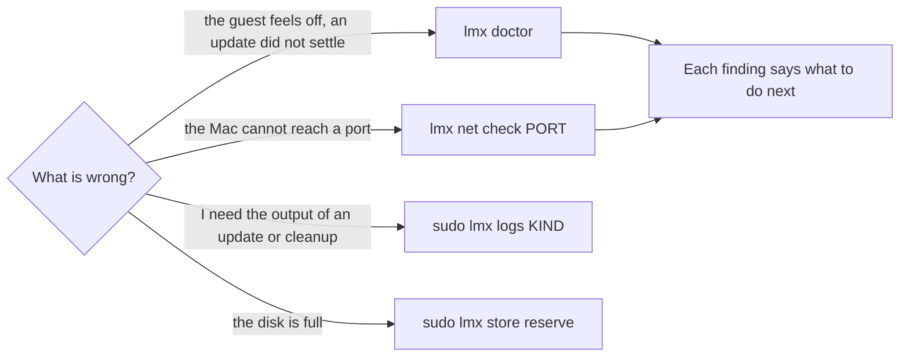

# When something is wrong

Start with the symptom and follow the arrow.



## `lmx doctor`

```console
$ lmx doctor
ok      config      /etc/lmx/config.json is valid; generation 0123456789ab.
ok      owner       lmxd 0.1.0 answers.
warning generations Generation 0123456789ab is built; restart the VM to boot it.
                    Restart the VM from the Mac; limanix update does it.
```

Every line is one check, and the indented line under it says what to do.

| Status | Means |
| -- | -- |
| `ok` | Fine. |
| `warning` | Worth knowing, nothing is broken. |
| `failed` | Broken. `lmx doctor` exits with status 1. |
| `unknown` | Your account may not read what the check needs; run `sudo lmx doctor`. |

It checks the configuration that NixOS wrote for `lmx`, whether `lmxd` answers
with the same version as `lmx`, the state of the generations, and the disk. It
works even when `lmxd` is down: that is one of the things it finds.

> [!TIP] On the Mac, `limanix doctor NAME` runs the same checks and adds the VM
> state and its address.

## `lmx net check PORT`

Your service runs, but the browser on the Mac cannot open it?

```console
$ lmx net check 8080
ok      firewall    TCP 8080 is open in the guest firewall.
failed  listener    TCP 8080 listens on 127.0.0.1 only and is reachable only inside the guest.
                    Make the application listen on 0.0.0.0 or the guest address.
ok      process     node (pid 812) holds the socket of user dev.
```

| Check | Asks |
| -- | -- |
| `firewall` | Does the guest firewall open the port? Ports come from `network.ports` in `limanix.toml` and from the modules you selected. |
| `listener` | Does anything listen on the port, and on an address the Mac can reach? |
| `process` | Which program holds the socket? |

Add `--udp` for a UDP port. On the Mac, `limanix network check NAME PORT` runs
the same checks and then tries to connect from the Mac.

<details>
<summary>The port is not open in the guest firewall</summary>

Add it to `network.ports` in `limanix.toml`, then run `limanix update` on the
Mac:

```toml
[network.ports]
tcp = [8080]
```

TCP 22 is always open for SSH.
[Networking](https://limanix.dev/categories/client/networking.html) walks
through the whole path from the Mac to the service.

</details>

<details>
<summary>Docker publishes the port</summary>

`lmx net check` warns when Docker's proxy holds the socket. Docker opens
published ports with its own firewall rules. `network.ports` has no say over
them, and removing a port from it does not close a port that Docker publishes.

</details>

## `lmx logs`

Every job of `lmxd` writes its output to the journal. `lmx logs` finds the
latest run of a kind:

| Run | Shows |
| -- | -- |
| `sudo lmx logs apply` | The build of a generation |
| `sudo lmx logs health` | The health check after a restart |
| `sudo lmx logs finalize` | The removal of older generations |
| `sudo lmx logs collect` | The last store cleanup |
| `sudo lmx logs roots` | The last report of what still holds space |

Add `--previous` to read the boot before the current one. An update builds in
one boot and restarts into the next: its build output is in
`sudo lmx logs apply --previous`.

## Common situations

<details>
<summary><code>lmx status</code> shows <code>Owner unknown</code>, or the prompt shows <code>lmxd?</code></summary>

`lmxd` does not answer. Your shell, files and services keep working; updates and
store upkeep wait until it is back.

Run `lmx doctor`. Its `owner` check says what failed and suggests
`systemctl status lmx.socket lmx.service` and `journalctl -u lmx`. A
`limanix update` from the Mac starts it again as part of the update.

</details>

<details>
<summary><code>lmx logs apply</code> says no apply ran in this boot</summary>

The update already restarted the VM. Run `sudo lmx logs apply --previous`.

</details>

<details>
<summary><code>pbpaste</code> prints nothing</summary>

The terminal on the Mac refused to share the clipboard, or did not answer within
10 seconds. Allow clipboard reads in its settings;
[Terminal and clipboard](https://limanix.dev/terminal.html) shows where.

</details>

<details>
<summary>The update finished with "ready, but lmx reported: Finalizing … failed"</summary>

The new generation works. Only the removal of older generations failed, and
`lmxd` retries it after 15 minutes. `sudo lmx logs finalize` shows why it
failed.

</details>
