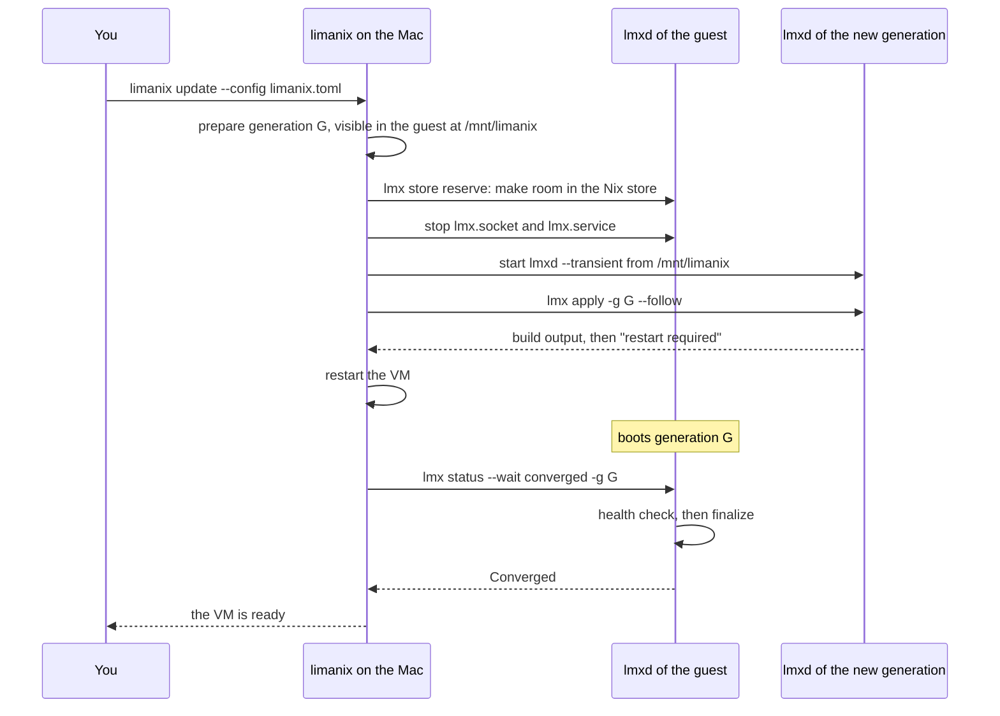
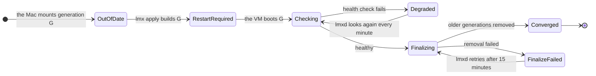

# How an update works

You run `limanix update` on the Mac, and a few minutes later the VM runs your
new configuration. This page shows what happens in between, and what you see
when a step goes wrong.

## The whole trip

Each `limanix update` hands the guest a new *generation*: the complete system
that your `limanix.toml` describes. The Mac prepares it, the guest builds it,
the VM restarts into it, and `lmxd` checks it.

Two details explain the odd-looking steps.

- **The new generation builds itself.** The Mac starts the `lmxd` that ships
  with generation G, not the one already in the guest. A VM made by an older
  client and a fresh one take the same steps.
- **The build belongs to `lmxd`, not to your terminal.** A dropped SSH
  connection does not stop it, and asking again attaches to the running build.

## Where a generation stands

`lmxd` compares three markers: the generation the Mac mounted, the one built for
the next boot, and the one running now. From them it derives a condition, the
same one `lmx status` and `lmx doctor` show.

| Condition | In plain words |
| -- | -- |
| `OutOfDate` | A generation is waiting to be built. |
| `RestartRequired` | It is built; the next boot runs it. |
| `Degraded` | It runs, but the health check failed. The message says why. |
| `FinalizeFailed` | It runs and is healthy, but removing older generations failed. Nothing is broken. |
| `Converged` | It runs, it is healthy, and the older generations are gone. |

While the check or the finalize runs, there is no condition at all; `lmx status`
shows the operation instead.

What does the health check look at?

`lmxd` waits 30 seconds after it starts, then checks the running generation:

- the platform services, such as `sshd` and the Lima guest agent, are active;
- the generation mount `/mnt/limanix` and your home are mounted;
- a login shell of your account starts.

The check may take up to 2 minutes. Its output lands in the journal:
`sudo lmx logs health`.

What does finalize remove?

Older system generations of the guest and their boot entries. Once they are
gone, `lmxd` collects the store paths that only they used. This is what keeps a
long-lived VM from filling its disk with past configurations. Finalize may take
up to 5 minutes; its output is in `sudo lmx logs finalize`.

## When you press Ctrl-C

Ctrl-C during `limanix update` cancels the build, not just your view of it. The
Mac runs `lmx apply cancel`, waits until the build stops, and brings the guest's
own `lmxd` back. The VM keeps running the generation it ran before, and the
update ends with status 130.

> [!NOTE] A boot loader update that `nixos-rebuild` already started finishes in
> its own unit. Stopping it halfway could leave the boot entries half-written.

## When a step fails

| What you see | What it means | Where to look |
| -- | -- | -- |
| The build fails | `nixos-rebuild` could not build generation G. The VM is not restarted and keeps the old generation. | The error on the Mac, then `sudo lmx logs apply` |
| The disk is full during the build | The store ran out of space or inodes. | [Disk and the Nix store](disk.md) |
| `Degraded` after the restart | G runs, but a service, mount or the login shell failed its check. | `lmx doctor`, then `sudo lmx logs health` |
| "ready, but lmx reported: Finalizing … failed" | G works. Only the cleanup failed, and `lmxd` retries it. | `sudo lmx logs finalize` |

> [!TIP] After the restart, the build ran in the *previous* boot. Read its
> output with `sudo lmx logs apply --previous`.
